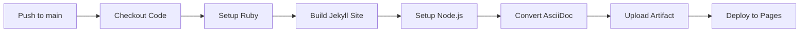

# GitHub Actions Workflow Documentation

## Overview

This repository uses **GitHub Actions** to automatically build and deploy the documentation site to GitHub Pages whenever changes are pushed to the `main` branch.

## How It Works

### Trigger
The workflow runs when:
- Changes are pushed to `main` branch in the `docs/` directory
- Workflow file itself is modified
- Manually triggered via GitHub UI

### Build Process



### Steps Explained

1. **Checkout** - Gets the latest code
2. **Setup Ruby** - Installs Ruby 3.1 and Bundler
3. **Build Jekyll** - Converts Markdown to HTML
4. **Setup Node.js** - Prepares for AsciiDoc conversion
5. **Install Asciidoctor** - Adds AsciiDoc tooling
6. **Convert AsciiDoc** - Renders `.adoc` files to HTML
7. **Upload Artifact** - Packages the built site
8. **Deploy** - Publishes to GitHub Pages

## File Naming Convention

### Markdown
- **Source:** `quickstart-1-chat-llm.md`
- **Output:** `quickstart-1-chat-llm.html`

### AsciiDoc
- **Source:** `quickstart-1-chat-llm.adoc`
- **Output:** `quickstart-1-chat-llm-asciidoc.html`

The `-asciidoc` suffix prevents naming conflicts.

## Viewing Build Status

### Check Workflow Run
1. Go to repository **Actions** tab
2. Click on latest **Build and Deploy GitHub Pages** run
3. View build logs and status

### Deployment URL
Once deployed, site is available at:
```
https://[username].github.io/demo-platform-quickstart-test/
```

## Manual Trigger

To manually trigger a build:

1. Go to **Actions** tab
2. Select **Build and Deploy GitHub Pages** workflow
3. Click **Run workflow** button
4. Select `main` branch
5. Click **Run workflow**

## Workflow File Location

```
.github/workflows/deploy-pages.yml
```

## Required Permissions

The workflow needs these permissions (configured in the workflow file):

```yaml
permissions:
  contents: read    # Read repository content
  pages: write      # Write to GitHub Pages
  id-token: write   # Generate deployment token
```

## Environment Configuration

### GitHub Pages Settings

**Required Setup:**
1. Go to **Settings → Pages**
2. Set **Source** to: `GitHub Actions`
3. Save

The workflow handles everything else automatically.

## Troubleshooting

### Build Fails
- Check **Actions** tab for error logs
- Verify `Gemfile` has correct dependencies
- Ensure Ruby version matches workflow (3.1)

### AsciiDoc Not Rendering
- Verify `.adoc` files exist in `docs/`
- Check asciidoctor installation step succeeded
- Look for conversion errors in build logs

### Pages Not Updating
- Check deployment step completed successfully
- Clear browser cache
- Wait 1-2 minutes for CDN propagation

### Local vs Remote Differences
Remember:
- **Local:** `bundle exec jekyll serve` (no AsciiDoc conversion)
- **Remote:** GitHub Actions (includes AsciiDoc conversion)

To test locally with AsciiDoc:
```bash
# Convert manually
asciidoctor -a icons=font docs/quickstart-1-chat-llm.adoc

# Then serve
cd docs && bundle exec jekyll serve
```

## Workflow Optimization

### Caching
- Ruby gems cached via `bundler-cache: true`
- Reduces build time on subsequent runs

### Concurrency
- Only one deployment at a time
- New deployments cancel pending ones

## Modifying the Workflow

To customize:

```bash
# Edit workflow file
code .github/workflows/deploy-pages.yml

# Test changes
git add .github/workflows/deploy-pages.yml
git commit -m "Update workflow"
git push

# Monitor in Actions tab
```

## Success Indicators

✅ Workflow completes without errors
✅ Site accessible at GitHub Pages URL
✅ Both Markdown and AsciiDoc formats render
✅ Format toggle buttons work
✅ Red Hat theme applies correctly

---

**Last Updated:** 2025
